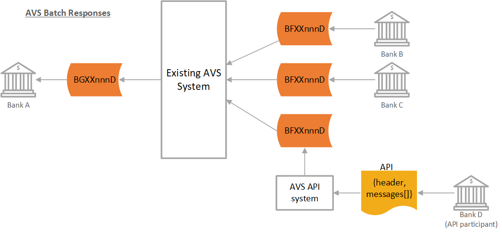
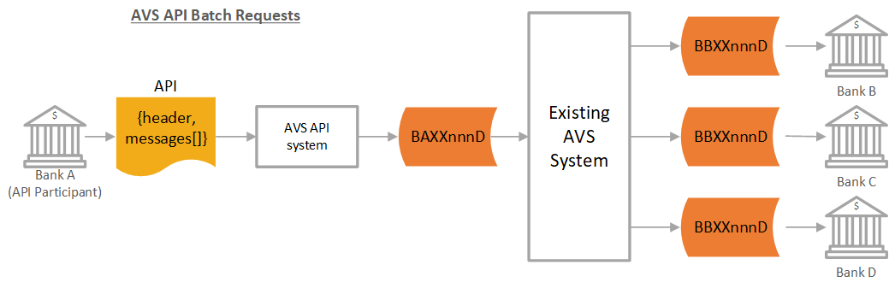
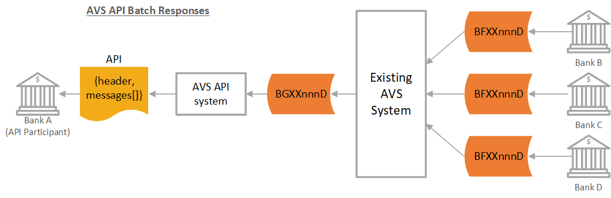

## AVS Batch Flow

### Request Messages

* Bank A sends a file, containing multiple AVS transactions to be validated, to BankservAfrica.  
* BankservAfrica validates the file and creates new files for each of the issuing participants for the verification of these transactions by the receiving banks.  
* Should a receiving bank be registered for the AVS API service,  BankservAfrica will convert the requests contained in the BBXXXnnnD file for that bank into an API and send that to an endpoint defined by the API participant bank.  
These API messages will contain a maximum of 100 transactions each (or a jointly agreed upon number of transactions).  
The header record within the JSON payload of the API message will indicated the number of transactions contained in the API.  

### Response Messages

* The receiving participants verify the transactions and send their responses back to BankservAfrica in the relevant files (one response file for each request file received) within the defined SLA time period.
* API participant banks will send their responses to BankservAfrica in a JSON message as defined in this document.
* API responses received by BankservAfrica will be consolidated into a BFXXnnnD file and passed to the current AVS batch system.
* All the responses will then be consolidated by BankservAfrica and returned to the requesting bank.

### API Batch Request Messages  

* Bank A, (an API participant bank) sends a batch of transactions for validation to the BankservAfrica API Gateway.
* BankservAfrica creates a corresponding BAXXnnnD  file which is passed to the current AVS Batch processing system.
* BankservAfrica validates the file and creates new files for each of the issuing participants for verification of these transactions. 

### API Batch Response Messages

* The receiving participants verify the transactions and send their responses back to BankservAfrica in the relevant files (one response file for each request file received), within the defined SLA time period.
* All the responses will then be consolidated by BankservAfrica into a BGXXnnnD file.
* For an API participant bank, BankservAfrica will convert the response batch file into an API and send that to an endpoint defined by the API participant bank.
These transactions will be sent in API messages containing a maximum of 100 transactions each (or any other jointly agreed upon number of transactions).
The header record within the JSON payload of the API message will indicated the number of transactions contained in the API.
