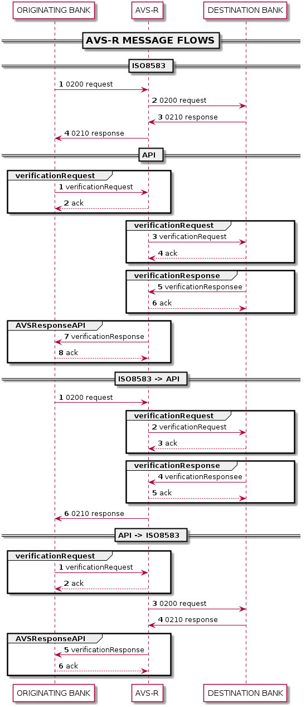

# Verification  

  

## Verification Service

### Using an API to interface to AVS-R

+ The originating bank will send a message containing the information to be validated in the verificationRequest message.
+ The recipient acknowledges with an HTTP ack response.
+ This request will be passed onto the destination (receiving) bank either as creditTransferRequest(API) or as an ISO8583 AVS-R message for validation.  
+ The recipient once again acknowledges with an HTTP ack response to the verificationRequest or if making use of the ISO8583 AVS system, the response will be an ISO8583 210 response message.
+ The receiving bank then responds with the validation response information (note – no additional information will be returned in the response, other than what was contained in the original request and the relevant True/False or not validated indicators). This response may be returned as a verificationResponse (API) message or as an ISO8583 210 AVS-R response, which BankservAfrica will convert to a verificationResponse.
+ The recipient acknowledges with an HTTP ack response (if appropriate).
+ The verificationResponse will then be sent on to the originating (requesting) bank.
+ The recipient acknowledges with an HTTP ack response.
